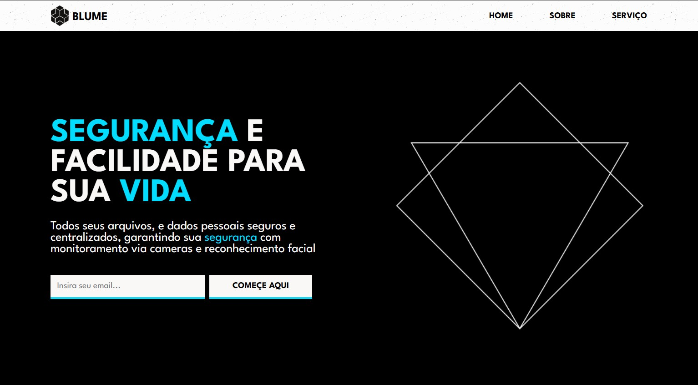

# Blume Corporation - Landing page 
### Landing page de um conglomerado de tecnologia responsável pela criação e implementação do ctOS na cidade de Chicago.
 
- Home: Seção inicial com título, breve descrição, botão criação de conta e menu para navegar entre seções

- Sobre: Quais serviços a empresa oferece, como funciona e mensagem da CEO da empresa

- Serviço: Inscrição para teste de nova versão do sistema operacional

---

---

# Processo

## Design
### Design e layout feito usando pacote Adobe 

1 - Obter referência e layout

2 - Escolher tema e obter assets

3 - Escolher cores

---

## Planejamento

1 - Fazer desenho de caixas (grid-flex) antes de escrever qualquer código, definindo quais elementos serão usados (desenho no PDF abaixo)

### Aqui há um PDF com todos os assets, design, planejamento e referência de layout

([blume-corp-designs](https://drive.google.com/drive/folders/1TF4VByKTwq_53_bC0mjlV1xZL46uJQts?usp=sharing))

---

# Aprendizados

### Reduzir tamanho (MB) das imagens
- Comprimi todas as imagens do projetos, cuidei do tamanho antes de começar o projeto, para não precisar trocar depois de terminar o código, tive essa experiência no projeto passado

---

# Tecnologias utilizadas
- HTML5 Markup 
- CSS
- Clean Code
- Photoshop
- Illustrator

# Autor
### Jefferson Augusto (a.k.a Benssssss) 
## [LinkedIn](https://www.linkedin.com/in/benssssss/)

## Projeto n.º11
